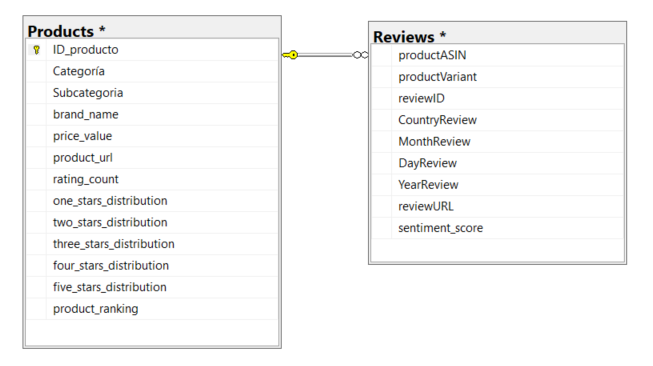
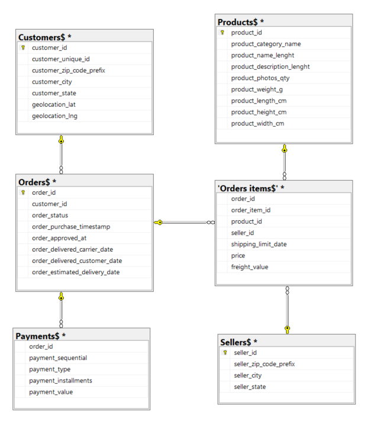

# About me

Hi! 👋 I'm David, welcome to my Data Analytical portafolio. 

This repository serves as a collection of projects that demonstrate my ability to transform raw data into actionable insights, supporting data-driven decision-making.

I am excited to bring my technical and analytical skills to the field of data analysis as an aspiring Data/BI Analyst. I focus on the entire analytical workflow: from querying and cleaning data to building interactive dashboards and telling a compelling story with findings, all of this using SQL, Python, Power BI and Tableau. 

This portfolio is a testament to my problem-solving approach, attention to detail, and my drive to derive meaningful answers from data. 

Feel free to explore the projects below to see how I apply these tools to real-world business scenarios.

Attachs my [CV](https://github.com/dsmartinezlopez/Portafolio_Data_Analysis/blob/main/_CV%20--%20David%20Santiago%20Mart%C3%ADnez%20L%C3%B3pez%20(1).pdf) in Spanish.
Attachs my [CV](https://github.com/dsmartinezlopez/Portafolio_Data_Analysis/blob/main/CV%20(EN)%20-%20David%20Santiago%20Mart%C3%ADnez%20L%C3%B3pez%20(1).pdf) in English.

# Portafolio Projects

### SQL:
  - **Project 1 (Entry-level):** [Amazon products review](https://github.com/dsmartinezlopez/Portafolio_Data_Analysis/blob/Portafolio-projects-1/SQL/Product_Reviews.md)
  
  **Goal:** Explore in detail a [Kaggle](https://www.kaggle.com/datasets/lazylad99/amazon-e-commerce-product-and-review-dataset ) database to obtain information on reviews of textile products (clothing) that are sold on [Amazon](https://www.amazon.com/?&tag=googleuscol05-20&ref=pd_sl_7d0mn8q9wb_e&adgrpid=159179349492&hvpone=&hvptwo=&hvadid=675113331081&hvpos=&hvnetw=g&hvrand=5229642513776563736&hvqmt=e&hvdev=c&hvdvcmdl=&hvlocint=&hvlocphy=9219397&hvtargid=kwd-10573980&hydadcr=8635_13668851&language=es_US) through sentiment analysis and product ranking.
  
  **Description:** On one hand, the database contains information about products categorized as clothing, with a unique identifier that is the product item, as well as the brands or stores that sell it and the ratings it has received from buyers. On the other hand, regarding reviews, there is data on the country, review dates, and sentiment score.

  **Schema:**

  
  
  
  **Skills:** Data Importation, Data Manipulation, JOINS, aggregation functions, category functions, date functions, CTE query's, sub-query's, windows functions. 
  
  **Technology:** `MS SQL Server`, `T-SQL`

  **Conclusion:** The database was successfully imported into MS SQL Server, and then the model to be analyzed was created, ensuring the correct handling of null values, the connection between tables, and the cleaning of the data to include only what was truly needed. This was done to answer, through queries, the business questions that companies ask themselves on a daily basis.

 

  

  - **Project 2 (Medium-level):** [Brazilian e-commerce](https://github.com/dsmartinezlopez/Portafolio_Data_Analysis/blob/Portafolio-projects-1/SQL/Brazilian%20E-commerce.md) + [Tableau Dashboard](https://public.tableau.com/app/profile/david.santiago.martinez.lopez/viz/Anlisise-commerceenBrasil/Operativo)

  **Goal:** Explore in detail a [Kaggle](https://www.kaggle.com/datasets/olistbr/brazilian-ecommerce) database to obtain information about on e-commerce in Brazil, presenting key operational indicators such as delivery times and on-time fulfillment. It also offers a business perspective on revenue metrics, which are often of interest to company executives in this industry.
  
  **Description:** 

  **Schema:**

  

  
  **Skills:** 
  
  **Technology:** `MS SQL Server`, `T-SQL`, `Tableau`

  **Conclusion:**

-------------------------------------------------------------------------------------------------------------------------------------

### Tableau:

[Tableau Public](https://public.tableau.com/app/profile/david.santiago.martinez.lopez/vizzes)

> [!NOTE]
> This is my public profile showcasing some projects that have caught my attention. I invite you to explore them and follow me!

-------------------------------------------------------------------------------------------------------------------------------------

### Power BI: 
  - Project 1: [Dashboard Icfes Saber Pro](https://github.com/dsmartinezlopez/Portafolio_Data_Analysis/blob/Portafolio-projects-1/Resultados%20Icfes%20SaberPro.pbix)
  
> [!TIP]
> (Download raw for use the original Dashboard version)
   
  **Goal:** Use Data Analysis for:
  
Identify areas for improvement in higher education to better prepare students.
Connect the skills of future professionals with the needs of the labor market.
Detect gaps and opportunities in different regions to reduce inequalities.
Improve the quality of human capital, a fundamental pillar for the country's progress.
  
  **Description:** The Icfes Saber Pro are a standardized assessment tool in Colombia that measures the competencies of higher education students. These results are key to understanding the quality of education and guiding public policy. The results of the Saber Pro tests not only reflect academic performance, but also directly impact Colombia's productivity and competitiveness.
  
  **Skills:** Data Visualization, Data Manipulation, Storytelling.
  
  **Technology:** `DAX`, `Power Query`, `Power Pivot`, `M`.
  
  **Results:** 
  1. In comparison of the overall scores, socioeconomic stratum 6 vs the others is 47.69% above the national average.
  2. In the overall results, distance learning students were -36.94% below the average while face-to-face students were 6.43% above, that is, a GAP of 43.37% between the two.
  3. The overall score of students living in rural areas was 22.6% below the national average.  

-------------------------------------------------------------------------------------------------------------------------------------

### Python:
  - Project 1: [Statistical analysis of Icfes Saber Pro results](https://github.com/dsmartinezlopez/Portafolio_Data_Analysis/blob/Portafolio-projects-1/Proyecto%20Icfes.ipynb)

> [!NOTE]
> This is a continuation of Power BI Project 1: Dashboard Icfes Saber Pro; here, statistical analyses are performed to test hypotheses.
    
  **Goal:** Statistically demonstrate the verification of these 3 hypotheses:

  1. The higher the socioeconomic stratum, the better students perform on English test results.
  2. In the field of engineering, students who studied in person were better prepared for employment than students who studied remotely.
  3. Students who live in municipal capitals are better prepared for employment than students who live in rural areas.

  **Description:** For this project, given that the sample sizes of the population taking the Icfes Saber Pro tests differed for each of the hypotheses presented above, statistical analyses such as normality tests, homogeneity of variance tests, parameterization tests, and even tests tailored to the number of groups to be evaluated for each hypothesis were necessary. For the first hypothesis, the Kruskal-Wallis, Dunn's post-hoc, and Cliff's Delta tests were used. For the second hypothesis, the Welch-Satterthwaite t-test was used. Finally, for the third hypothesis, the Chi-square test was used.
  
  **Skills:** Statistic Models, Data Cleaning, Data Manipulation, Data Visualization.
  
  **Technology:** `Pandas`, `Numpy`, `Matplotlib`, `Seaborn`, `Scikit-learn`.
  
  **Results:** The results found for each of the hypotheses were:
  
  1. It was demonstrated that there are differences in English test scores and that they are correlated with the socioeconomic status of the students, indicating a strong tendency for those with more economic resources to be better able to master the language.
  2. Statistically, a strong trend was found for engineering students to achieve better results on the Icfes Saber Pro exams compared to those who studied remotely. This suggests that the mode of study can directly influence student education and, consequently, impact Colombia's productivity; universities should focus on this.
  3. There is a correlation between variables and a dependence between place of residence and the results of the Saber Pro tests. This is a worrying issue because it creates a social gap in education, meaning that students living in rural areas are receiving a lower level of education than those living in urban centers. The government and the Ministry of Education must focus on reducing inequalities and educational gaps.

  
# Contact

- LinkedIn: www.linkedin.com/in/david-santiago-martínez-lópez
- Email: davidsantiagomartinez1@gmail.com

